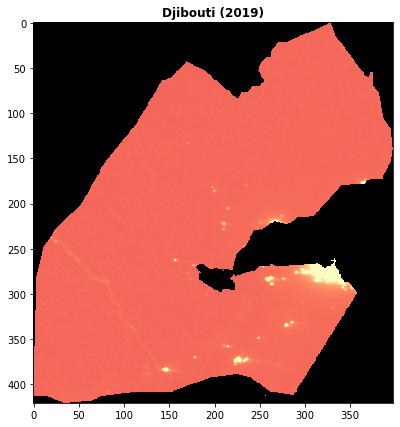

# High Resolution Electricity Access (HREA)

## Overview

The [HREA](http://www-personal.umich.edu/~brianmin/HREA/index.html) project aims to provide open access to new indicators of electricity access and reliability across the world. Leveraging satellite imagery with computational methods, these high-resolution data provide new tools to track progress toward reliable and sustainable energy access across the world.

This dataset includes settlement-level measures of electricity access, reliability, and usage for 89 nations, derived from nightly VIIRS satellite imagery. Specifically, this dataset provides the following annual values at country-level granularity:

1. **Access**: Predicted likelihood that a settlement is electrified, based on night-by-night comparisons of each settlement against matched uninhabited areas over a calendar year.

2. **Reliability**: Proportion of nights a settlement is statistically brighter than matched uninhabited areas. Areas with more frequent power outages or service interruptions have lower rates.

3. **Usage**: Higher levels of brightness indicate more robust usage of outdoor lighting, which is highly correlated with overall energy consumption.

4. **Nighttime Lights**: Annual composites of VIIRS nighttime light output.

For more information and methodology, please visit the [HREA website](http://www-personal.umich.edu/~brianmin/HREA/index.html).

## Storage resources

Data are stored in blobs in the West Europe Azure region, in the following blob container:

`https://hreadatasa.blob.core.windows.net/hrea`

Within that container, data are organized within folders named according to:

`HREA_[country]_[year]_v1`

* `country` is one of the supported countries, enumerated below
* `year` is a four-digit year from 2012 to 2019

For example, the following folder contains data for Burkina Faso from 2016:

`HREA_Burkina_Faso_2016_v1`

Within each folder, data are available as 15 arc-second cloud-optimized GeoTIFF files, with four files per folder:

* `[country]_rade9lnmu_[year].tif`: Nighttime light annual composite.
* `[country_set_zscore_sy_[year].tif`: Statistically estimated brightness levels. Higher levels indicate more robust usage of outdoor lighting, which is correlated with overall energy consumption.
* `[country]_set_lightscore_sy_[year].tif`: Predicted likelihood that a settlement is electrified (0 to 1).
* `[country]_set_prplit_conf90_sy_[year].tif`: Proportion of nights a settlement is statistically brighter than matched uninhabited areas.

For example, the nighttime light annual composite for Djibouti in 2019 is located in:

`https://hreadatasa.blob.core.windows.net/hrea/HREA/HREA_Djibouti_2019_v1/Djibouti_rade9lnmu_2019.tif`

The data hosted on Azure is derived from the [source](http://www-personal.umich.edu/~brianmin/HREA/index.html) by converting each file into cloud-optimized GeoTIFF format file using [rio cogeo 2.1.2](https://github.com/cogeotiff/rio-cogeo).

## Sample code

A complete Python example of accessing and plotting HREA data is available in the accompanying [sample notebook](hrea.ipynb).

## Citation

If you use the HREA data, please cite as follows:

Min, Brian and O'Keeffe, Zachary. 2021. High Resolution Electricity Access Indicators Dataset. Ann Arbor, MI: Center for Political Studies, University of Michigan.

## Pretty picture

Annual composite of nighttime lights for Djibouti in 2019.

## Contact

For questions about this hosted instance of the dataset, contact [`aiforearthdatasets@microsoft.com`](mailto:aiforearthdatasets@microsoft.com?subject=hrea%20question).

For questions about the dataset contents or methodology, see the [project website](http://www-personal.umich.edu/~brianmin/HREA/data.html) .

## License

This data set is licensed under [CC BY 4.0](http://creativecommons.org/licenses/by/4.0/?ref=chooser-v1)

## List of countries for which HREA data are available

* Algeria
* Angola
* Argentina
* Bangladesh
* Belize
* Benin
* Bhutan
* Bolivia
* Botswana
* Burkina Faso
* Burundi
* Cambodia
* Cameroon
* Cape Verde
* Central African Republic
* Chad
* Colombia
* Comoros
* Congo Republic
* DR Congo
* Djibouti
* Dominican Republic
* Ecuador
* Egypt
* El Salvador
* Eritrea
* Eswatini
* Ethiopia
* Gambia
* Ghana
* Grenada
* Guatemala
* Guinea
* Guinea-Bissau
* Guyana
* Haiti
* Honduras
* Hong Kong
* Indonesia
* Iraq
* Ivory Coast
* Jamaica
* Jordan
* Kenya
* Laos
* Lesotho
* Liberia
* Libya
* Madagascar
* Malawi
* Malaysia
* Mali
* Marshall Islands
* Mauritania
* Mexico
* Mozambique
* Namibia
* Nepal
* Nicaragua
* Niger
* Nigeria
* Pakistan
* Panama
* Papua New Guinea
* Paraguay
* Peru
* Puerto Rico
* Rwanda
* Saint Lucia
* Sao Tome and Principe
* Senegal
* Sierra Leone
* Solomon Islands
* South Africa
* South Korea
* Sri Lanka
* Suriname
* Tanzania
* Thailand
* Timor-Leste
* Togo
* Trinidad and Tobago
* Tunisia
* Uganda
* Uruguay
* Vanuatu
* Vietnam
* Zambia
* Zimbabwe

## Notices

Microsoft provides this dataset on an "as is" basis.  Microsoft makes no warranties (express or implied), guarantees, or conditions with respect to your use of the dataset.  To the extent permitted under your local law, Microsoft disclaims all liability for any damages or losses - including direct, consequential, special, indirect, incidental, or punitive - resulting from your use of this dataset.  This dataset is provided under the original terms that Microsoft received source data.
